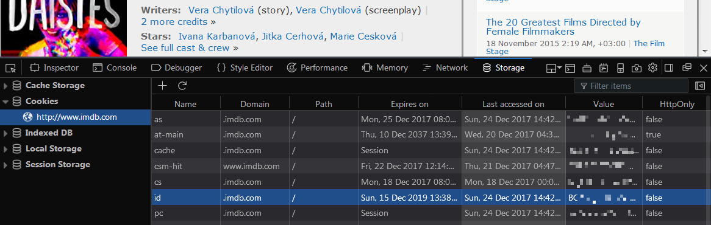
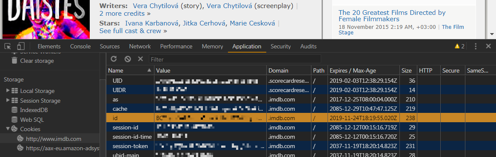

# icm-backup-lists

A simple tool to backup all your lists from IMDb including your watchlist and ratings. Creates a .zip archive with .csv files exported from the site. To prevent filesystem errors all personal lists are renamed to `ls0XXXXXXXX_latinized-list-name.csv`, but all original list titles (including multiline ones) are preserved in `titles.txt` in the same archive.

## Installation:

The easiest way to run this tool is to download a portable executable from the [Releases](https://github.com/monk-time/imdb-backup-lists/releases) tab (only for Windows 7 atm, but it *might* work on other versions all well). The executable is created with PyInstaller but is *not* an installer. 

Otherwise you can run it from the source code:

1. Make sure you have Python 3.6+ installed:

   ```console
   $ python --version
   Python 3.6
   ```

2. Install `requests`, `beautifulsoup4` and `unidecode` libraries:

   ```console
   $ pip install requests beautifulsoup4 unidecode
   ```

3. Download `imdb_backup.py` from the repo.
   
## How to run:

1. Copy your IMDb `id` cookie from your browser:
   1. Open any page on IMDb.
   2. Open Developer tools in your browser:
      - Firefox: ≡ → Web Developer → Storage Inspector<br><br>
        
      - Chrome: ⫶ → More tools → Developer tools → Application tab<br><br>
        
   3. Expand "Cookies" in the left panel and select `http://www.imdb.com`.
   3. Find a row named "id", double click on its cell in the "Value" column and copy it.  
   
2. Create a new file `imdb_cookie.txt` in the script directory and paste the cookie into it. 

3. Use any of the following steps to run the tool (depending on which file you've downloaded):
   - Executable (`imdb_backup.exe`):
     - double click on the file
     - or type `$ imdb_backup.exe --nopause` in the command line
   - Script (`imdb_backup.py`):
     - double click on the file 
     - or type `$ python imdb_backup.py --nopause` in the command line

4. After the tool has finished running, `imdb_exported_lists.zip` should appear in your working directory.

## Building

`$ pyinstaller --onefile imdb_backup.py`
